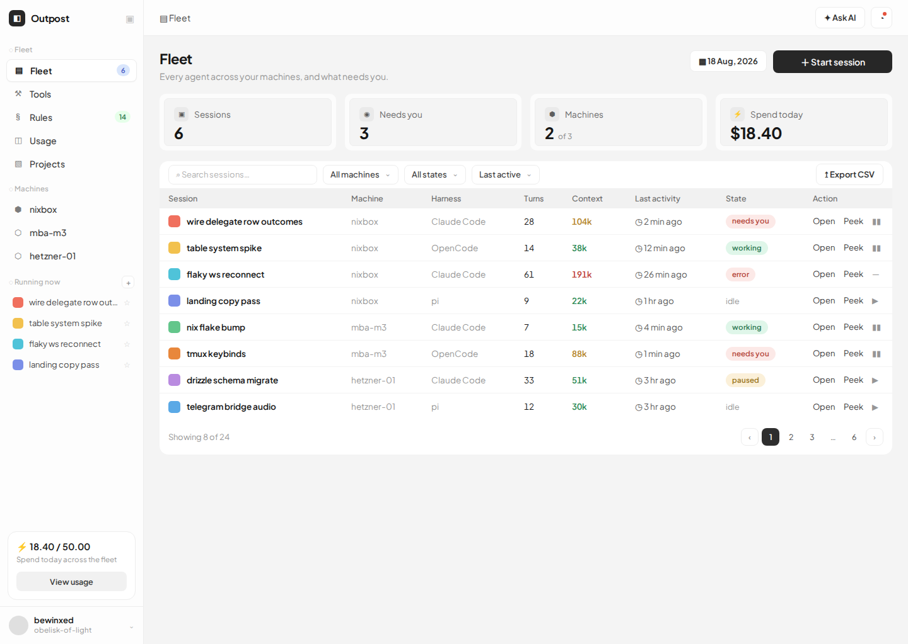
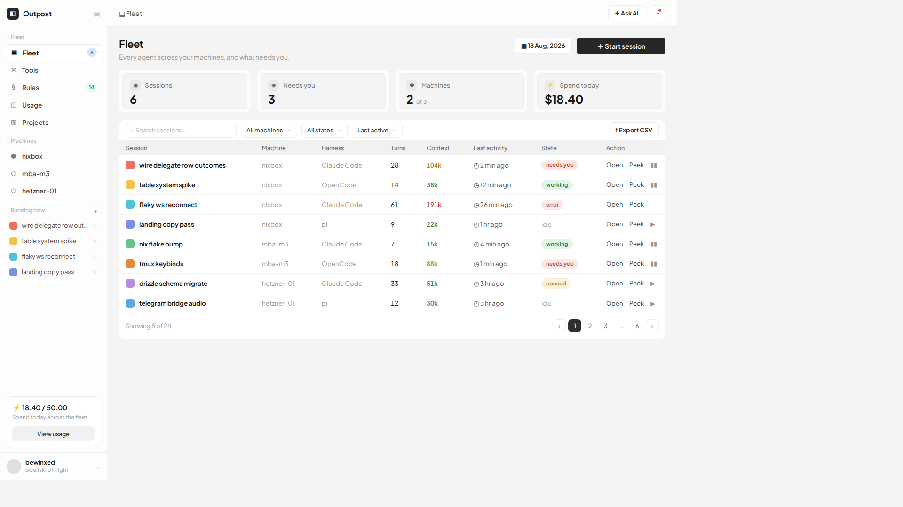

# V2 Final

## 📋 Test Information

- **Test Name**: `v2_final`
- **URL**: http://localhost:8901/v2-fleet.html?v=1787045668
- **Timestamp**: 2026-08-18T09:34:29.650Z
- **Viewports**: mobile, desktop

## 📊 Results

### ♿ Accessibility Score: 0/100

⚠️ **1 violation(s) found:**

#### 1. Ensure the contrast between foreground and background colors meets WCAG 2 AA minimum contrast ratio thresholds
- **Impact**: serious
- **Affected Elements**: 35
- **Example**: `
◌ Fleet
`

### 📐 Layout Observations

_Measured facts, not verdicts. Full structured detail is in `report.json`._

**mobile (375x667) — 370 observation(s) · scope: body — 265 elements, 1287 text chars, 2 interactive, 0 images, 1440x1023px**
- escapes-viewport: 200
- sibling-padding-differs: 9
- sibling-gaps-differ: 18
- horizontal-overflow: 1
- text-clipped: 1
- near-miss-alignment: 141
- · escapes-viewport body: right edge 1440px vs 375px viewport
- · sibling-padding-differs aside: 0/14/0/14 vs 0/14/0/14 vs 0/10/0/10 vs 0/14/0/14 vs 0/10/0/10 vs 0/14/0/14 vs 0/10/0/10 vs 13/13/13/13 vs 0/14/0/14
- · sibling-gaps-differ aside (column): edgeGaps 14, 6, 14, 5.9, 14, 6, 249, 10px | pitches 71, 22.7, 198, 22.6, 124, 26, 380, 118.7px
- · sibling-gaps-differ aside > div.brand:nth-of-type(1) (row): edgeGaps 9, 89px | pitches 35, 150px
- · sibling-padding-differs aside > nav:nth-of-type(1) > div.nav-i.on:nth-of-type(1): 0/0/0/0 vs 1.5/7/1.5/7
- · ...and 365 more (full detail in report JSON)

**desktop (1920x1080) — 170 observation(s) · scope: body — 265 elements, 1287 text chars, 2 interactive, 0 images, 1440x1023px**
- sibling-padding-differs: 9
- sibling-gaps-differ: 18
- horizontal-overflow: 1
- text-clipped: 1
- near-miss-alignment: 141
- · sibling-padding-differs aside: 0/14/0/14 vs 0/14/0/14 vs 0/10/0/10 vs 0/14/0/14 vs 0/10/0/10 vs 0/14/0/14 vs 0/10/0/10 vs 13/13/13/13 vs 0/14/0/14
- · sibling-gaps-differ aside (column): edgeGaps 14, 6, 14, 5.9, 14, 6, 249, 10px | pitches 71, 22.7, 198, 22.6, 124, 26, 380, 118.7px
- · sibling-gaps-differ aside > div.brand:nth-of-type(1) (row): edgeGaps 9, 89px | pitches 35, 150px
- · sibling-padding-differs aside > nav:nth-of-type(1) > div.nav-i.on:nth-of-type(1): 0/0/0/0 vs 1.5/7/1.5/7
- · sibling-padding-differs aside > nav:nth-of-type(1) > div.nav-i:nth-of-type(3): 0/0/0/0 vs 1.5/7/1.5/7
- · ...and 165 more (full detail in report JSON)

## 📸 Screenshots

### mobile (375x667)

### desktop (1920x1080)

